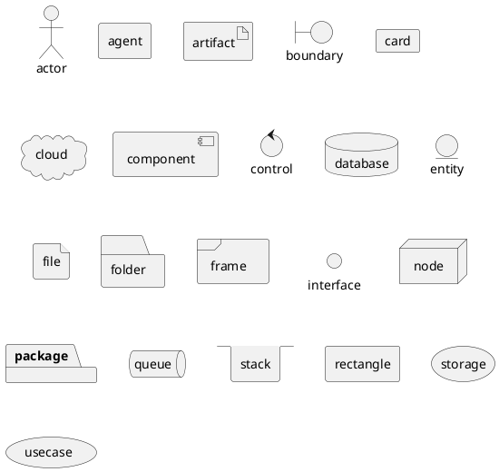
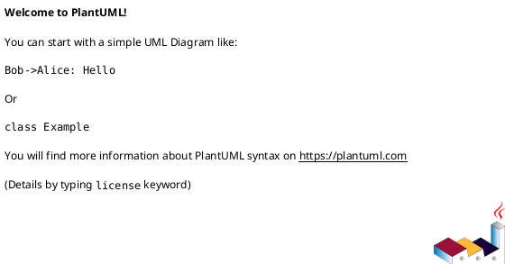
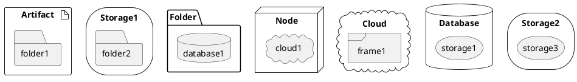
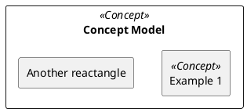

元素类型（package/node/folder/frame/cloud/database）、
颜色、
连接、
箭头（填充）、
注释（note
left:、note left of、note right:、note right of、note top:、note top of、note bottom:、note bottom of）、
包装、
属性&方法（private/protected/public）、
范型、
显示/隐藏、
非字母字符、
别名、
component componentName 或[componentName]/abstract/interface 或()/annotation/enum、
模板（<<>>）
html 标签、
换行（\n）、
方向（-> 表示横向、--> 表示纵项、-left->、-right->、-up->、-down->）、
自动编号

```
<b> 加粗
<u> 下划线
<i> 倾斜
<s> 删除
<del>
<strike>
<font color="#AAAAAA">
<font color="red">
<color:#AAAAAA>
<color:red>
<size:16>


```

### 声明元素





### 链接


```plantuml
cloud cloud1
cloud cloud2
cloud cloud3
cloud cloud4
cloud cloud5
cloud1 -0- cloud2
cloud1 -0)- cloud3
cloud1 -(0- cloud4
cloud1 -(0)- cloud5
```

### 包装

全局名唯一，区分大小写



### 圆角


