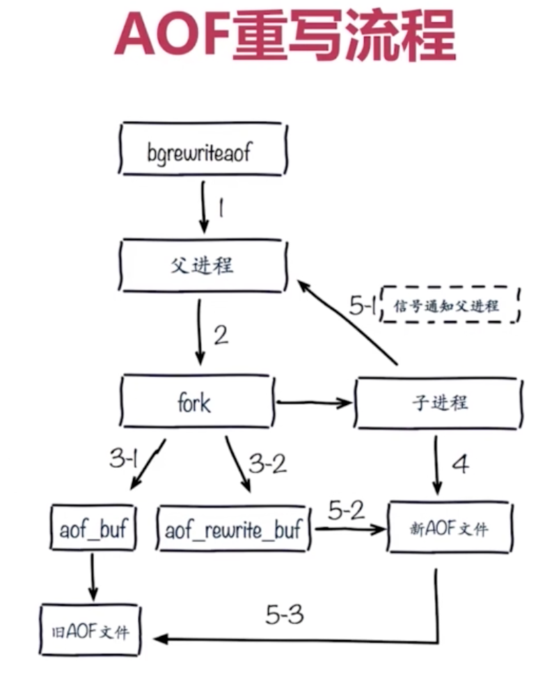
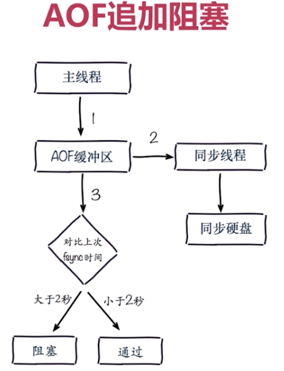

redis命令是微妙级别  
配置
```bash
# master节点 #
daemonize yes
pidfile /var/run/redis-6379.pid
port 6379
logfile "6379.log"
# save 900 1
# save 300 10
# save 60 10000 
dbfilename dump-6379.rdb
dir /opt/soft/redis/redis/data/
# masterauth <pass> 主节点密码
slave-read-only yes # 从节点只读

# slave节点 #
daemonize yes
pidfile /var/run/redis-6380.pid
port 6380
logfile "6380.log"
# save 900 1
# save 300 10
# save 60 10000 
dbfilename dump-6380.rdb
dir /opt/soft/redis/redis/data/
# masterauth <pass> 主节点密码
slave-read-only yes # 从节点只读
slaveof 127.0.0.1 6379
```
命令
```bash
flushall # 清除数据
redis-cli -p 6379
redis-cli -p 6379 info replication # 查看节点分片信息
redis-cli -p 6379 info server | grep run # 查看run_id
info replication # 查看分片信息
config get * # 获取所有配置  
config set appendonly yes # 动态配置
config rewrite # 配置生效
redis-server redis.conf # 指定配置文件启动
dbsize
info memory # 查看内存使用情况  
ps -ef | grep redis- | grep -v "redis-cli" | grep -v "grep" # 查看redis服务端进程
tail -f redis.log # 查看日志
redis-cli shutdown # 关闭
more appendonly # 查看aof文件
```

### 慢查询
客户端超时不一定是慢查询，但慢查询是客户端超时的一个可能原因，2种修改配置生效方法： 1. 修改配置后重启，2. 动态配置，
要理解命令生命周期，定期持久化慢查询
```bash
# 配置 #
# 先进先出队列，固定长度，保存在内存内
slowlog-log-slower-than 10000 # 微秒，默认10000，通常设置1ms 0 表示记录所有命令 <0 不记录所有命令
slowlog-max-len 128 # 默认128，通常设置1000
# 命令 #
config get slowlog-log-slower-than
config get slowlog-max-len
slowlog get [n] # 获取慢查询队列
slowlog len # 获取慢查询队列长度
slowlog reset # 清空慢查询
```
- 生命周期
  1. 发送命名
  2. 排队
  3. 执行命令（慢查询发生阶段）
  4. 返回结果

### pipeline
每次携带数据量不要太大，每次只能作用在一个Redis节点上，M操作与pipeline区别
- 流水线
- 客户端实现
- 与原生操作对比
- 使用建议
### 发布订阅
- 角色：publisher、subscriber、channel，订阅者可订阅多个频道
- 模型
- API: `publish`、`subscribe`、`unsubscribe`、`psubscribe [pattern...]`、`punsubscribe [pattern...]`、`pubsub channels` 列出至少有一个订阅者的频道，`pubsub numsub [channel...]` 列出给定频道的订阅者数量
- 消息队列：多个客户端订阅了一个消息，是抢的，即只有一个能收到
### Bitmap
```bash
set hello big
getbit key offset
getbit hello 2 # 取ascii码的位置，从0开始
setbit key offset value # value只能是0或1
setbit unique:users:2016-04-05 0 1
bitcount key [start end] # 获取位图指定范围的位值为1的个数
bitpo op destkey key [key...] # 做多个Bitmap的and（交集）、or（并）、not(非)、xor(异或)的操作并将结果保存在destkey中
bitop and unique:users:and:2016_04_04-2016_04_05 unique:users:and:2016_04_04 unique:users:and:2016_04_05
bitpos key targetBit [start] [end] # 计算位图指定范围（start到end，单位为字节，如果不指定就是获取全部）第一个偏移量对应的值等于targetBit的位置

# 实现独立用户统计 #
```
type=string 最大512M
注意setbit时的偏移量，可能有损耗
位图不是绝对好
### HyperLogLog
基于HyperLogLog算法：极小空间完成独立数量统计  
是否能容忍错误？错误率0.81%  
是否需要单条数据？取不出来  

```bash
type hyperloglog_key # string
pfadd key element [element...] # 添加
pfcount key [key...] # 计算总数
pfmerge destkey sourcekey [sourcekey...] # 和并

# 实现独立用户统计 #
pfadd 2017_03_06:unique:ids "uuid-1" "uuid-2" "uuid-3" "uuid-4" # 添加成功返回1
pfcount 2017_03_06:unique:ids # 4
pfadd 2017_03_06:unique:ids "uuid-1" "uuid-2" "uuid-3" "uuid-90" # 返回1 
pfcount 2017_03_06:unique:ids # 5
pfadd 2017_03_05:unique:ids "uuid-4" "uuid-5" "uuid-6" "uuid-7"
pfcount 2017_03_05:unique:ids # 4
# 合并
pfmerge 2017_03_05_06:unique:ids 2017_03_05:unique:ids 2017_03_06:unique:ids
pfcount 2017_03_05_06:unique:ids # 8
```
### GEO
v3.2新增功能，存储经纬度，计算两地距离，范围计算，没有删除API
```bash
type geoKey # zset
geo key longitude latitude member [longitude latitude member...]
geopos key member [member...]
geodist key member1 member2 [unit] # unit: m（米）、 km（千里）、mi（英里）、ft(尺)
# 计算范围 withcoord 返回结果中包含经纬度 withdist 返回结果中包含距离中心节点位置 withhash 返回结果中包含geohash COUNT count 指定返回结果的数量 asc|desc 返回结果按照距离中心节点的距离做升序或降序 store key 将返回结果的地理位置信息保存到指定键 storedist key 将返回结果中距离中心节点的距离保存到指定键
georadius key longitude latitude radiusm|km|ft|mi [withcoord] [withdist] [withhash] [COUNT count] [asc|desc] [store key] [storedist key]
georadiusbymember key member radiusm|km|ft|mi [withcoord] [withdist] [withhash] [COUNT count] [asc|desc] [store key] [storedist key]

geoadd cities:locations 116.28 38.55 beijing # 1
geoadd cities:locations 116.28 38.55 beijing # 1
geoadd cities:locations 117.12 39.08 tianjing 114.29 38.02 shijiazhuang 118.01 39.08 tangshan 115.29 38.51 baoding # 4
geopos cities:locations tianjin # 1) 117.12000042200088501 2) 39.080000535766543
geodist cities:locations tianjin beijing km # 89.2061
georadiusbymember cities:locations beijing 150 km # tianjin shijiazhuang tangshan baoding
```

### 持久化
实现方式：
- 快照：MySQL Dump、Redis RDB
- 写日志：MySQL Binlog、 Hbase HLog、Redis AOF

#### RDB
copy-on-write策略，RDB是二进制文件，重启后重新载入即可恢复，默认 dump.rdb  
配置文件
```conf
# 满足任一条件即生成RDB文件
# 好的优化是关闭save配置
# save 900 1
# save 300 10
# save 60 10000
# dbfilename dump.rdb
dbfilename dump-${port}.rdb # 使用多核端口区分
# dir ./
dir /bigdiskpath # 使用较大硬盘
stop-writes-on-bgsave-error yes # bgsave发生错误时停止写入
rdbcompression yes # 压缩格式
rdbchecksum yes # 校验和检验
```
命令或生成RDB文件机制
```bash
# 文件策略：新的替换老的，复杂度O(n)
save # 同步命令，返回 OK
# 使用linux fork命令一个redis（fast）去createRDB，文件策略和复杂度和save一样，子进程名为redis-rdb-bgsave
bgsave # 异步命令，返回Background saving started
# 配置文件自动触发
```

| 命令 | save | bgsave |
|:----|:------|:------|
| IO类型 | 同步 | 异步  |
| 阻塞 | 是 | 是（阻塞发生在fork）  |
| 复杂度 | O(n) | O(n)  |
| 优点 | 不会消耗额外内存 | 不阻塞客户端命令  |
| 缺点 | 阻塞客户端命令 | 需要fork，消耗内存  |

触发机制：
- 全量复制
- debug reload
- shutdown

问题：耗时、耗性能，不可控，容易丢数据  
最佳策略：“关”、集中管理、

#### AOF
写命令是写进缓冲区中  
配置文件
```bash
appendonly yes
appendfilename "appendonly-${port}.aof"
appendfsync everysec
dir /bigdispath
no-appendfsync-on-rewrite yes
auto-aof-rewrite-min-size 64mb # AOF重写需要的尺寸
auto-aof-rewrite-percentage 100 # AOF 文件增长率
aof-load-truncated yes # 忽略aof错误
```
统计
```bash
aof_current_size # AOF当前尺寸（单位：字节）
aof_base_size # AOF上次启动和重写的尺寸（字节）
```
命令
```bash
# 重写aof文件
bgrewriteaof # 异步，返回ok，子进程名

```
策略：
- always，每条命令fsync到硬盘中
- everysec，每秒把缓冲区fsync到硬盘（默认）
- no，由OS决定fsync

| 命令 | always | everysec | no |
|:----|:------|:------|:-------|
| 优点 | 不丢失数据 | 每秒一次fsync丢1秒数据  | 不用管 |
| 缺点 | IO开销较大，一般的sata盘只有几百TPS | 丢1s数据  | 不可控 |

重写：减少硬盘占用量、加速恢复速度
重写触发时机： 同时满足 aof_current_size > auto-aof-rewrite-min-size 和 aof_current_size - aof_base_size/aof_base_size > auto-aof-rewrite-percentage  
最佳策略：开缓存和存储、AOF重写集中管理、everysec



| 命令 | RDB | AOF |
|:----|:------|:------|
| 启动优先级 | 低 | 高  |
| 体积 | 小 | 大  |
| 恢复速度 | 快 | 慢  |
| 数据安全性 | 丢数据 | 根据策略决定  |
| 轻重 | 重 | 轻  |

AOF & RDB最佳策略：小分片（max-memory 4G）、缓存或者存储、监控（硬盘、内存、负载、网络）
足够内存

### 开发运维常见问题
1. fork操作
   - 涉及
     1. 同步操作
     2. 与内存量息息相关：内存越大、耗时越长（与机器类型有关）
     3. info: lastest_fork_usec 上次执行耗费的微妙数
   - 改善
     1. 优先使用物理机或者高效支持fork操作的虚拟化技术
     2. 控制Redis实例最大可用内存：maxmemory 
     3. 合理分配Linux内存分配策略 vm.overcommit_memory=1 不阻塞内存分配
     4. 降低fork频率：放款AOF重写触发时机，不必要的全量复制
2. 进程外开销
   - CPU开销：RDB和AOF文件生成属于CPU密集型
   - CPU优化：不做CPU绑定，不和CPU密集型部署
   - 内存开销：fork内存开销，copy-on-write
   - 内存优化：echo never > /sys/kernel/mm/transparent_hugepage/enabled
   - 硬盘开销：AOF和RDB文件写入，可以结合iostat、iotop分析
   - 硬盘优化：不要和高硬盘负载服务部署在一起：存储服务、消息队列，no-appendfsync-on-rewrite = yes，根据写入量决定磁盘类型，单机多实例持久化文件目录可以考虑分盘
  

阻塞日志：  
info persistence 中 aof_delayed_fsync 的值，查看硬盘  

### 复制
一个slave只能有一个master，数据只能从master到slave
方式1：配置
```conf
slaveof ip port
slave-read-only yes
```
方式2：命令
```bash
# slave 127.0.0.1 6380
slaveof 127.0.0.1 6379 # 是127.0.0.1 6379 master
slaveof no one # 返回ok，将slave不从任何master
```
| 方式 | 命令 | 配置 |
|:----|:------|:------|
| 优点 | 无需重启 | 统一配置  |
| 缺点 | 不便于管理 | 需要重启  |

如果要对只读的从节点写操作报：(error) READONLY You can't write against a read only slave
全量复制和部分复制

### sentinel

### cluster

### 缓存设计与优化

### CacheCloud

### bloom filter