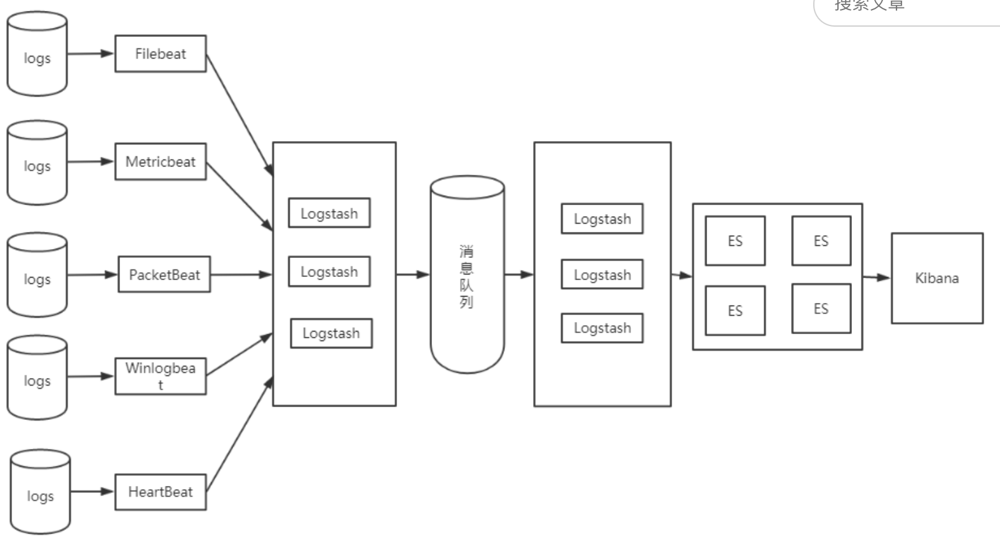

1.0 ttl + *.log
2.0 Hadoop日志离线批处理 + Storm流处理框架 + Spark内存计算框架
3.0 ELK、Sulunk、SILK



#### Beats
- Filebeat，收集文件数据
- Metricbeat，收集系统、进程、和文件系统级别的CPU和内存使用情况
- Packetbeat，收集网络流数据，可以实时监控系统应用和服务，可以将延迟时间、错误、响应时间、SLA性能等信息发送到Logstash或Elasticsearch
- Windlogbeat，收集Window事件日志数据
- Heartbeat，监控服务器运行状态

开启端口
```bash
sudo iptables -L -n
sudo iptables -A INPUT -p tcp --dport 9200 -j ACCEPT
sudo service iptables restart
sudo service iptables stop 
sudo service iptables status
```

##### 错误解决
问题：max file descriptors [4096] for elasticsearch process likely too low, increase to at least [65536]
```bash
sudo vim /etc/security/limits.conf
```
```bash
* soft nofile 65536
* hard nofile 131072
* soft nproc 2048
* hard nproc 4096
```
问题：max number of threads [1024] for user [lish] likely too low, increase to at least [2048]
```bash
sudo vim /etc/security/limits.d/90-nproc.conf
```
```bash
* soft nproc 2048
```
问题：max virtual memory areas vm.max_map_count [65530] likely too low, increase to at least [262144]
```bash
sudo vim /etc/sysctl.conf 
```
```bash
vm.max_map_count=655360
```
执行
```bash
sysctl -p
```
问题：max file descriptors [4096] for elasticsearch process likely too low, increase to at least [65536]

`scp /Users/zhuyudong/Desktop/Software/jdk-8u151-linux-x64.tar.gz jk@172.20.20.207:/home/jk/download` 将本地文件上传至服务器指定目录

#### 启动
```bash
./bin/elasticsearch # 前台运行 elasticsearch
nohup ./bin/elasticsearch & # 后台运行elasticsearch
jobs -l # 查看后台进程
ps -aux | grep elasticsearch # a 所有程序 u 以用户为主的格式显示 x 显示所有程序，不以终端机来区分
ps -aux | grep elasticsearch | grep -v grep # 将grep命令过滤掉
ps -aux | grep elasticsearch | grep -v grep | awk '{print $2}' # 显示进程号
lsof -i:9200
netstat -nap | grep 9200
kill -9 进程号

# elasticsearch-head
grunt server # 前台启动
nohup grunt server &exit # 守护进程运行
ps aux | grep head

# kibana
./bin/kibana  # 前台运行
nohup ./bin/kibana &exit # 守护进程运行
ps aux | grep kibana

# fielbeat
./filebeat -e -c filebeat.yml # 前台运行
nohup ./filebeat -e -c filebeat.yml &exit # 守护进程运行
```

#### elasticsearch 配置文件
config/elasticsearch.yml 修改 
```yml
network.hot: 172.20.20.207
http.cors.enabled: true
http.cors.allow-origin: "*"
```  
jvm.options  
log4j2.properties  

#### 安装 elasticsearch-head 插件
```bash
git clone git://github.com/mobz/elasticsearch-head.git
cd elasticsearch-head
npm install
npm run start
```
修改配置文件Gruntfile.js
```js
connect: {
    server: {
        options: {
            hostname: '0.0.0.0',
            port: 9100,
            base: '.',
            keepalive: true
        }
    }
}
```

#### kibana
修改配置文件 config/kibana.yml
```yml
server.host: '0.0.0.0'
```

#### filebeat
修改配置文件 filebeat.yml
```yml
filebeat.prospectors:
- type: log
  enabled: true
  paths:
    - /home/bee/Documents/elk6/sampledata/ucas.log.2017-11-15
  multiline.pattern: ^\[
  multiline.negate: true
  multiline.match: after
output.elasticsearch:
  hosts: ["localhost:9200"]
```

  
[elasticsearch http://172.20.20.207:9200](http://172.20.20.207:9200)  
[elasticsearch-head http://172.20.20.207:9100](http://172.20.20.207:9100)  
[kibana http://172.20.20.207:5601](http://172.20.20.207:5601)  
[http://grokdebug.herokuapp.com/](http://grokdebug.herokuapp.com/)

#### 参考资料
- [ELK 日志处理开发指南](http://gitbook.cn/books/5a5d719c97dd75359eba4d8f/index.html)
- [Elasticsearch 5.1.1 head插件安装指南](http://blog.csdn.net/napoay/article/details/53896348)
- [搭建Elasticsearch 5.4分布式集群](http://blog.csdn.net/napoay/article/details/52202877)