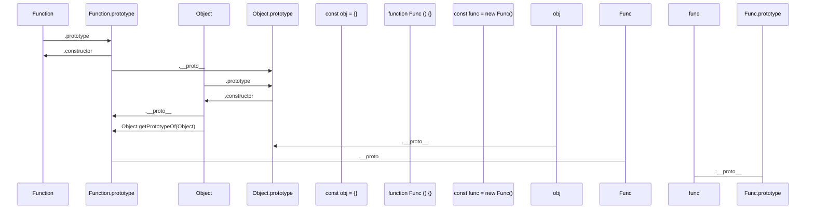

- 每个构造函数都有一个原型对象（prototype），原型对象都包含一个指向构造函数的指针，而实例（instance）

```mermaid
sequenceDiagram
    participant Function
    participant Function.prototype
    participant Object
    participant Object.prototype
    participant const obj = {}
    participant function Func () {}
    participant const func = new Func()
    Function ->> Function.prototype: .prototype
    Function.prototype ->> Function: .constructor
    Function.prototype ->> Object.prototype: .__proto__
    Object ->> Object.prototype: .prototype
    Object.prototype ->> Object: .constructor
    Object ->> Function.prototype: .__proto__
    Object ->> Function.prototype: Object.getPrototypeOf(Object)
    obj ->> Object.prototype: .__proto__
    Func -> Function.prototype: .__proto
    func -> Func.prototype: .__proto__

```

1. 经典继承-借用构造函数

2. 组合继承
3. 原型继承
4. 寄生式继承
5. 寄生组合式继承
6. new