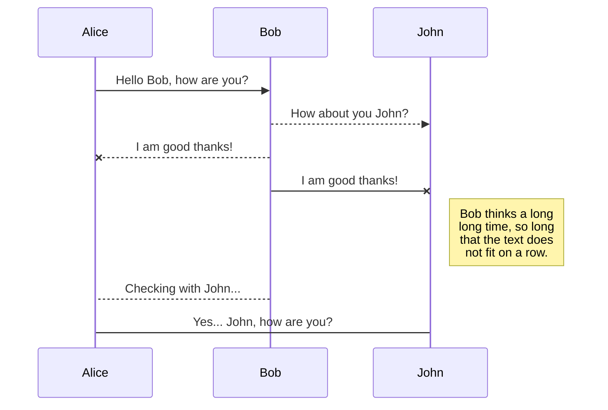
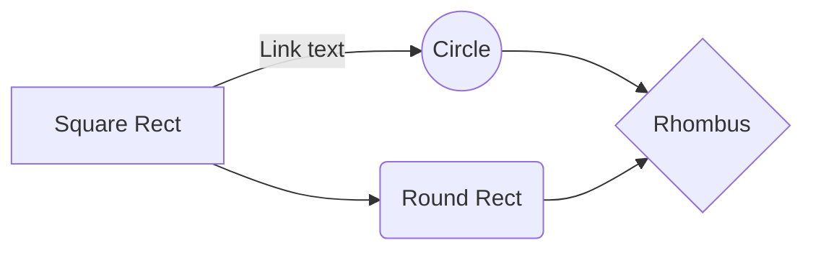

# Blog

[收集想添加的功能](https://feathub.com/)  
[提问的智慧](https://github.com/ryanhanwu/How-To-Ask-Questions-The-Smart-Way)  
[如何向开源社区提问题](https://github.com/seajs/seajs/issues/545)  
[如何有效地报告 Bug](https://www.chiark.greenend.org.uk/~sgtatham/bugs-cn.html)  
[如何向开源项目提交无法解答的问题](https://zhuanlan.zhihu.com/p/25795393)
[Tables Generator](http://www.tablesgenerator.com/)

## [Markdown extensions](https://stackedit.io/app#)
### KaTeX

You can render LaTeX mathematical expressions using [KaTeX](https://khan.github.io/KaTeX/):

The *Gamma function* satisfying $\Gamma(n) = (n-1)!\quad\forall n\in\mathbb N$ is via the Euler integral

$$
\Gamma(z) = \int_0^\infty t^{z-1}e^{-t}dt\,.
$$

> You can find more information about **LaTeX** mathematical expressions [here](http://meta.math.stackexchange.com/questions/5020/mathjax-basic-tutorial-and-quick-reference).

### UML diagrams

You can render UML diagrams using [Mermaid](https://mermaidjs.github.io/). For example, this will produce a sequence diagram:

And this will produce a flow chart:

