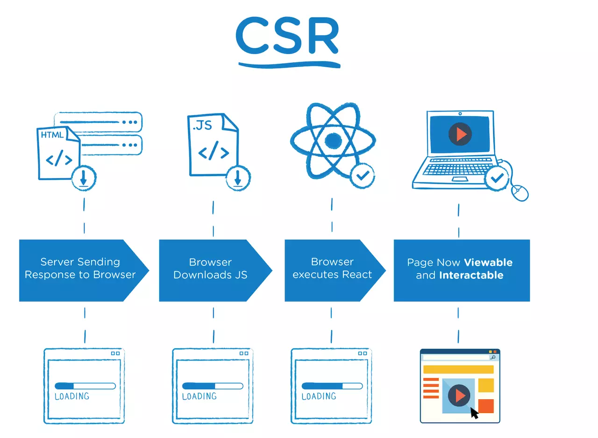
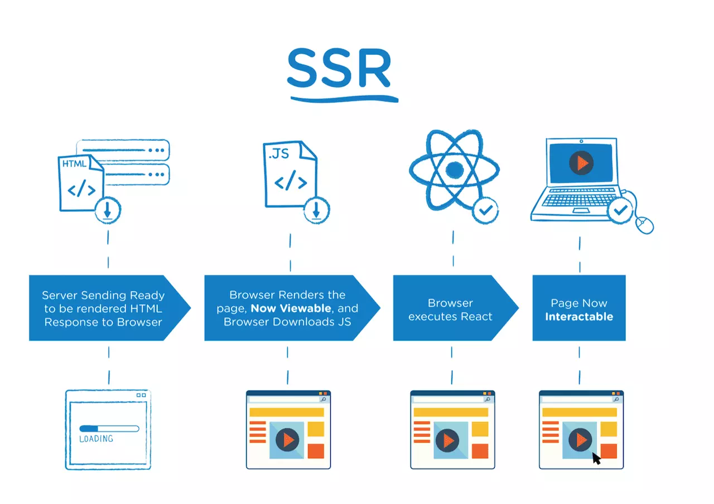
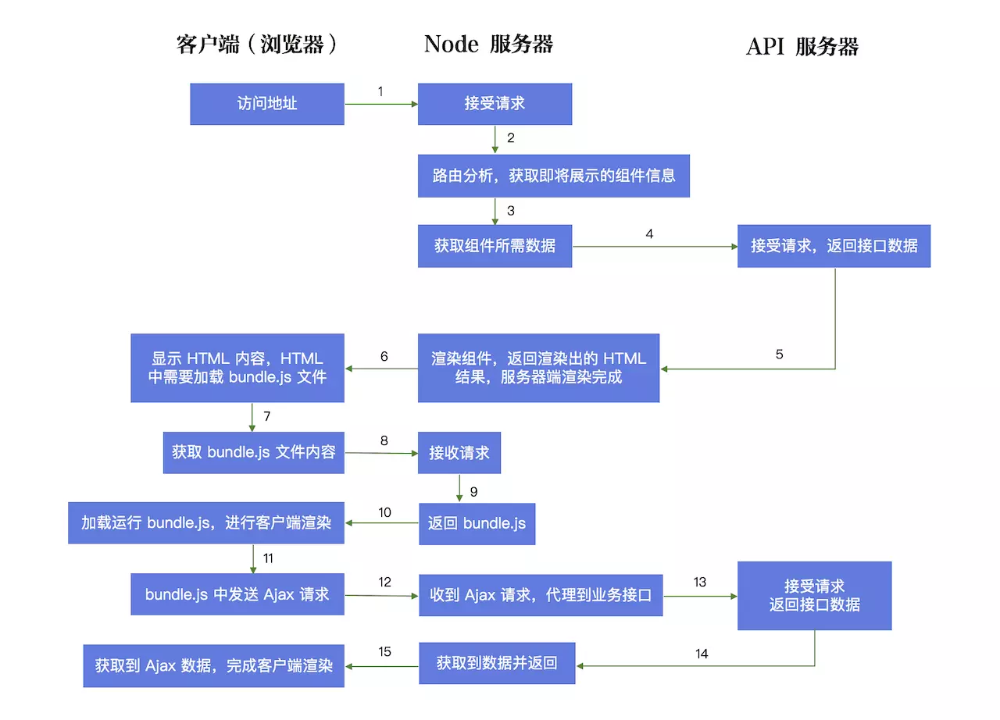

# 渐进式理解 react 服务端渲染

---

### 客户端渲染

---

### 特点
- 主流方案（create-react-app...）
- TTFP（Time To First Page）时间较长
  - code splitting
  - three shaking
  - lazy loading
  - dynamic loading
- 受限于浏览器宿主环境（单线程、文件处理、安全、存储等）

---

### 服务端渲染
- 特点
- 数据流
- 架构

---

### 特点
- SEO（Search Engine Optimization）友好
- 首屏渲染快 `performance.timing`
- 可以利用服务端能力（算力、文件处理能力等）
- 技术复杂

---

### 数据流1

---

### 数据流2

---

### 架构
1. http 服务
2. 环境准备：babel、webpack、eslint
3. 基于什么思想来划分目录及文件结构
4. 引入react、react-dom
5. 概念梳理：renderToString、同构、前后端路由、状态同步（数据注水、脱水）
6. 目录治理、公共抽象
7. 样式及文件处理
8. stream
9. 最佳实践
10. 性能、缓存、单测、压测、ORM、部署、监控、多进程架构

---

### 技术选型
- http：http.createServer -> **express** -> koa -> egg.js
- 约定（目录划分、文件命名）、配置（webpack、babel、环境变量、外部接口）
- 分治、聚合
- 分开构建、各自更新：**webpack** && **nodemon**
- 路由：**react-router**（BrowserRouter && StaticRouter、nest route、auth、event hooks）
- 状态：**redux**、**redux-thunk**/redux-saga、**react-redux**、 rematch、umi、unstate、mbox
- Server：style、dom、bom、file、redis
- 监控：**sentry**、**alinode**、**morgan**、winston/bunyan/log4js
- 部署：**nginx**、**pm2**、egg-cluster、cdn

---

### 谢谢！
