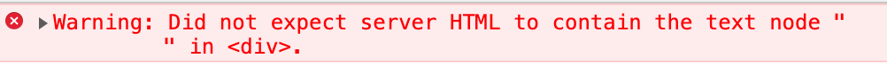

1. http 服务
2. 环境准备：babel、webpack、eslint
3. 基于什么思想来划分目录结构
4. 引入react、react-dom
5. 概念梳理：renderToString、同构、前后端路由、状态同步（数据注水、脱水）
6. 目录治理、公共抽象
7. 样式处理
8. stream
9. 单测、压测、部署、监控


不要使用 `babel-register`，用 `@babel/register`，当 `@babel/preset-env` 的 `{"useBuiltIns" "usage"}` 时需要引入 `core-js@3`

`webpack` 命令默认读取 webpack.config.js 并执行，如果需要指定配置则用 `webpack --config webpack.client.js`

使用`loadable-components` 替换 `react-loadable`
```json
{
  // 监听 dist 目录并执行其目录下 server.bundle.js 文件
  "dev:start": "nodemon --watch dist --exec node \"dist/server.bundle.js\""
}
```
项目根目录下单独服务端打包：`yarn dev:build:server` 或 `npx webpack --config build/webpack.server.js`， 然后 `yarn dev:start`
`webpack --watch` 只能自动重新打包，不能重启服务，`nodemon` 可以监听并重启后台服务，但是不会自动刷新页面

启动开发环境的2种方式：
1. node 端使用 commonjs，不使用esModule
2. 使用 `@babel/register`
```js
{
  "script": {
    "dev": "npm-run-all --parallel server server dev:build:client",
    "server": "node babel-register.js",
    "dev:build:client": "webpack --config build/webpack.client.js --watch"
  }
}
```
1. 使用 `webpack`
package.json
```json
{
  "script": {
    "dev": "npm-run-all --parallel dev:**",
    "dev:build:server": "webpack --config build/webpack.server.js --watch",
    "dev:build:client": "webpack --config build/webpack.client.js --watch",
    "dev:start": "nodemon",
  }
}
```
nodemon.json
```json
{
  "exec": "node dist/server.bundle.js"
}
```

### 问题
1. 客户端渲染与服务端渲染的区别
2. 配置写在哪里？
3. 为什么需要构建？前端 or 后端

### 思想
- 分治、整合
- 先分散再抽取

### 约定
- [Foldname]/index.js
- 文件名以__开头的表示临时文件，用于演示，不会正式启用
- equal-1、equal-2... 表示等价但不同的写法
- evolution-1、evolution-2... 表示进化的的写法，进化的内涵包括：修复缺陷、最佳实践、功能扩展...

### 进化
- 路由
  - 支持声明式、命令式路由跳转
  - 有路由钩子（跳转前、跳转中、跳转后）
  - 支持嵌套路由
  - 按约定式文件目录结构自动注入路由
- 抽象化 webpack 选项，拥有默认配置并开放修改
- 以自然方式使用 babel 配置

### 需要注意的点
- 凡是有 `jsx` 语法的地方都需要引入 `React`，否则会报 `ReferenceError: React is not defined`
- 服务端返回html如有空格/换行等会报：


### dependencies && devDependencies 说明
- `@babel/plugin-proposal-class-properties` class

### 未来
- 日志
- ORM
- 性能监控
- 服务监控
- 错误监控
- 多进程架构
